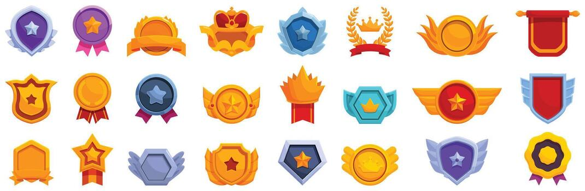

# Badges and Achievements

Badges and achievements are visual signs that show a student has reached a goal or mastered skill. They are often used in gamification. In gamification badges can make accomplishments easier to notice because they give students a clear record of what they have completed or mastered. 

## What Badges Represent

A badge should represent a meaningful accomplishment. For example, a student may earn a badge for completing and mastering a difficult topic. The title and design of a badge can make the achievement feel more memorable and personal.

## Creating Meaningful Badges

Badges work best when students understand exactly how to earn them. A badge should have a clear goal like completing five challenges or demonstrating a skill successfully. If badges are too easy to earn they may not feel important. If they are too difficult students may loose motivation. 

This image shows achievement badges that can recognize completed goals and developed skills.

## Recognition and Motivation

Badges can motivate students because they show evidence of progress. They may also encourage students to try activities that they may normally avoid. Keep in mind that badges should not take more importance than the activity itself. The real purpose should remain learning, improvement, and participation.

> A badge is most meaningful when it represents real effort, growth, or achievement.

### Related Notes

- [[Points and Rewards]]
- [[Levels and Progression]]
- [[Challenges and Quests]]
