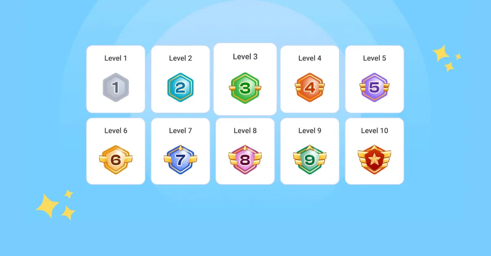

# Levels and Progression

Levels and progression systems organize an experience into steps. Students begin with basic tasks and gradually move towards more difficult goals. This structure is common in gamified activities to make a large goal feel more manageable and achievable.

## Moving Forward

A level gives students a clear target. After completing one level they unlock the next stage or recieve a new challenge. Progression can help students understand where they are in an assignment or activity and what they need to do next. It also gives them a sense of accomplishment when they finish a step.

This image shows a progression bath in which students complete one level before unlocking the next challenge.

## Why Progression Motivates Students

A progression system can make students more willing to continue because they see that their work is leading somewhere. Small successes can build confidence before a student attempts a harder task. Levels also make it possible to organize activities from introductory tasks to advanced challenges or topics.

1. Begin with a clear first goal.
2. Complete a task or demonstrate a skill.
3. Unlock a new level or challenge.
4. Receive feedback and continue improving.

## Avoiding Pressure

Levels should guide students instead of labeling them. A student who needs more time should still feel supported and able to continue progressing. A good gamification system allows students to learn from mistakes and try again without feeling embarrassed. 

### Related Notes

- [[Points and Rewards]]
- [[Challenges and Quests]]
- [[Leaderboards and Competition]]
