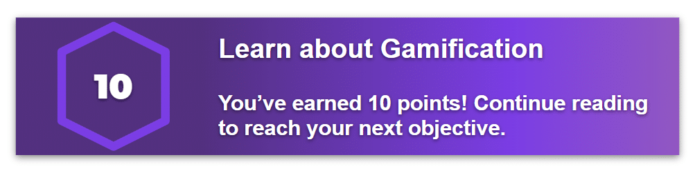

# Points and Rewards

Points and rewards are very common parts of gamification. They give students recognition when they complete an activity, reach a goal, or show improvement. In a gamified learning environment points can make progress visible. Instead of working towards one finaly score at the end of the unit students can earn smaller amounts of recognition as they complete different tasks.

This image represents how points and rewards make progress visible in a gamified activity.

## How Points Work

Points can be given for completing activities, making progress, or demonstrating a skill. A point system should have clear rules so students understand exactly how points are earned. When students know what actions lead to progress they may feel more motivated to participate.

## Types of Rewards

Rewards do not always have physical prizes. They can include digital points, positive feedback, a choice of activity, or recognition for effort. A useful reward system encourages meaningful actions instead of only rewarding those who finish first.

- Points can show completed work.
- Rewards can recognize improvement.
- Feedback can explain how to earn more points.
- Clear goals can make progress easier to understand.

## Using Points Carefully

Points should support the main purpose of an activity. If students only care about collecting points they may rush through tasks without learning or thinking carefully. A strong gamification system connects points to effort, participation, improvement, and quality work.

### Related Notes

- [[Badges and Achievements]]
- [[Levels and Progression]]
- [[Challenges and Quests]]
